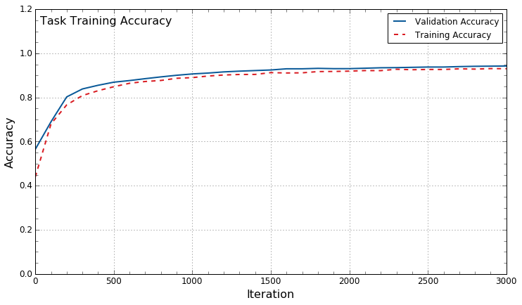
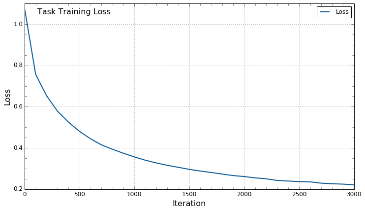

# TensorFlow Implementation of MLP

This is a walkthrough of a TensorFlow implementation of a Multi-Layered Perceptron (MLP), or also known as a Feed-Forward Neural Network. This is a re-implementation of an [MLP written in python/numpy](https://github.com/creoin/neulite), and also serves as an introduction to the TensorFlow python API.

The model has 2 fully-connected layers (one with 100 hidden units, one with 3 to match the number of output classes). It was tested on a "Task" dataset with 2 inputs, 3 classes, and 15,000 examples.

The model has ReLU activations, Dropout, and some L2 Regularisation.

## Clone

Since this repository contains a submodule, you need to use the --recursive flag:

```
git clone --recursive https://github.com/creoin/tensorflow_mlp.git
```

## How to run

An example has been included in `tensorflow_mlp.py`, this file can be studied to quickly see the main operations for setting up and training a TensorFlow model. A walkthrough the code has also been included in the `notebook` jupyter notebook, which includes more detailed explanations.

```
$ python3 tensorflow_mlp.py
```

### Example Output

Below is some example output from a Task dataset (not included in repo), which is a simple distribution of 3 classes in 2 coordinates. This example was taken from the `notebook` jupyter notebook.

Training progress:
```

Iteration          0: loss  1.072 train accuracy   0.440 valid accuracy   0.565
Iteration        100: loss  0.756 train accuracy   0.680 valid accuracy   0.690
Iteration        200: loss  0.653 train accuracy   0.767 valid accuracy   0.803
Iteration        300: loss  0.577 train accuracy   0.809 valid accuracy   0.839
Iteration        400: loss  0.525 train accuracy   0.831 valid accuracy   0.855
Iteration        500: loss  0.480 train accuracy   0.849 valid accuracy   0.869
Iteration        600: loss  0.444 train accuracy   0.864 valid accuracy   0.877
Iteration        700: loss  0.415 train accuracy   0.872 valid accuracy   0.885
Iteration        800: loss  0.394 train accuracy   0.877 valid accuracy   0.893
Iteration        900: loss  0.374 train accuracy   0.887 valid accuracy   0.901
Iteration       1000: loss  0.356 train accuracy   0.890 valid accuracy   0.907
Iteration       1100: loss  0.340 train accuracy   0.897 valid accuracy   0.911
Iteration       1200: loss  0.327 train accuracy   0.902 valid accuracy   0.916
Iteration       1300: loss  0.316 train accuracy   0.904 valid accuracy   0.919
Iteration       1400: loss  0.306 train accuracy   0.905 valid accuracy   0.922
Iteration       1500: loss  0.296 train accuracy   0.913 valid accuracy   0.925
Iteration       1600: loss  0.288 train accuracy   0.911 valid accuracy   0.930
Iteration       1700: loss  0.281 train accuracy   0.912 valid accuracy   0.930
Iteration       1800: loss  0.273 train accuracy   0.917 valid accuracy   0.932
Iteration       1900: loss  0.266 train accuracy   0.918 valid accuracy   0.931
Iteration       2000: loss  0.261 train accuracy   0.919 valid accuracy   0.931
Iteration       2100: loss  0.255 train accuracy   0.922 valid accuracy   0.933
Iteration       2200: loss  0.251 train accuracy   0.922 valid accuracy   0.935
Iteration       2300: loss  0.242 train accuracy   0.928 valid accuracy   0.935
Iteration       2400: loss  0.240 train accuracy   0.926 valid accuracy   0.937
Iteration       2500: loss  0.237 train accuracy   0.927 valid accuracy   0.938
Iteration       2600: loss  0.236 train accuracy   0.927 valid accuracy   0.938
Iteration       2700: loss  0.229 train accuracy   0.930 valid accuracy   0.940
Iteration       2800: loss  0.226 train accuracy   0.929 valid accuracy   0.941
Iteration       2900: loss  0.225 train accuracy   0.931 valid accuracy   0.942
Iteration       3000: loss  0.221 train accuracy   0.930 valid accuracy   0.943
```

Training and Validation Accuracy:



Training Loss:


